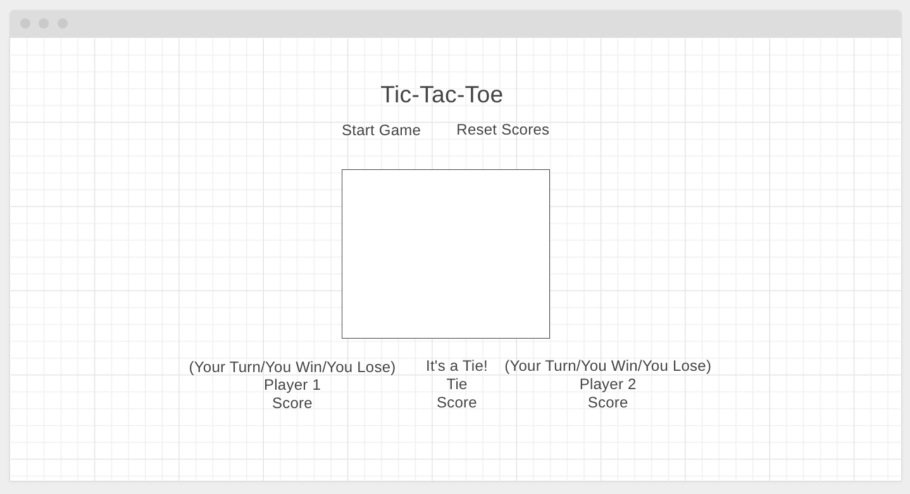
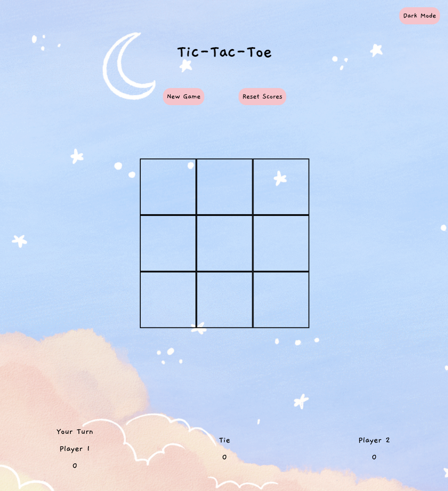
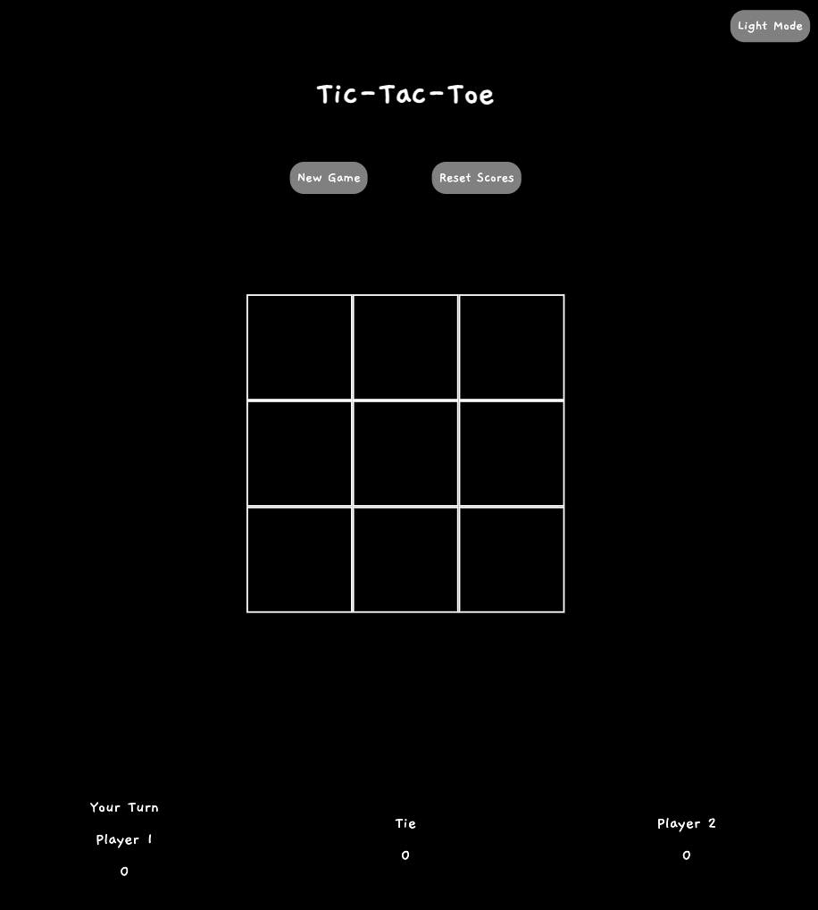

# Tic-Tac-Toe

## Table of Contents
* <a href="#about-the-game">About the Game</a>
* <a href="#how-to-play">How to Play</a>
* <a href="#technologies-used">Technologies Used</a>
    * <a href="#credits">Credits</a>
* <a href="#wireframe">Wireframe</a>
* <a href="#user-stories">User Stories</a>
* <a href="#development-process">Development Process</a>
* <a href="#what-i-would-do-different">What I Would Do Different</a>

---
## About the Game

Enjoy a fun and relaxing game of tic-tac-toe with a friend!

Tic-tac-toe is a game where two players take turns marking a space on a three-by-three square grid. The first player to get three-in-a-row wins.

This application was my first-ever project, and was created from scratch using JavaScript, HTML, and CSS.

---

## How to Play:

### Installation:

This game does not require any installation to run. It is played through the browser between two players using the same computer. 

[Click here to start playing](https://knnguyen2410.github.io/tictactoe/)

### Instructions

1. When you first open the game in the browser, a series of pop-ups will come up.
    * The first pop-up welcomes you to the game (click OK).
    * The subsequent pop-ups allow player 1 and then player 2 to customize their symbols.
    * Symbols can be a single character, a string, or an image URL.
    * If no custom symbol is entered, player 1 is X and player 2 is O by default.

     

2. Player 1 starts (click on any of the nine squares). 

3. After player 1 is done, it is automatically player 2's turn (click on any of the remaining squares).

4. Repeat steps 2 and 3 until the game ends. The game ends when a player gets three of their symbols in a row (the winning condition), or until all nine squares are filled (a tie). 

5. The score will be automatically updated at the end of each round at the bottom of the page.

6. To start a new game, click the "New Game" button at the top of the page.

7. To clear the scores, click the "Reset Scores" button at the top of the page.

8. To switch between light and dark mode, click the button at the very top right of the page.

---
## Technologies Used

* **[wireframe.cc](https://wireframe.cc/)**: Used to create wireframe.
* **Command Line**: Used to create and navigate files and folders.
* **Git**: Used for version control on local computer and pushing changes to remote repository.
* **GitHub**: Used to host the remote repository and hosting the live website. 
* **Visual Studio Code**: Used as the code editor for manipulating JavaScript, HTML, CSS files, and the README.
* **Google Chrome**: The **browser** was used for running the live environment and accessing materials on the internet. The **Developer Tools** features were used for debugging.

 

### Credits

* Code from [Bobby Hadz](https://bobbyhadz.com/blog/javascript-check-if-url-is-image)

    I used this code snippet to detect if a player's symbol input is an image URL. The function takes a URL and returns true if the string input ends with an image file extension.
        
        function isImage(url) {
        return /\.(jpg|jpeg|png|webp|avif|gif|svg)$/.test(url);
        }
* Favicon tic-tac-toe image from here: https://stock.adobe.com/search/images?k=3x3
* Light theme background image from here: https://www.pinterest.com/pin/580894051940117418/
* Audio from [Zapsplat](https://www.zapsplat.com/)
    * [Color theme button sound]( https://www.zapsplat.com/music/caravan-bathroom-sink-light-switch-press-on-or-off/)
    * [New Game button sound]( https://www.zapsplat.com/music/clean-digital-game-tone-level-up-win-or-finish/)
    * [Reset Scores button sound]( https://www.zapsplat.com/music/several-pieces-of-a4-paper-dump-into-small-plastic-trash-can-2/)
    * [Player 1 click sound]( https://www.zapsplat.com/music/game-sound-short-single-click-pop-generic-use-4/)
    * [Player 2 click sound]( https://www.zapsplat.com/music/game-sound-short-single-click-pop-generic-use-2/)
    * [Winner announcement sound](https://www.zapsplat.com/music/alert-prompt-win-positive-tone-000/)

  

Thank you to Dhrubo Chowdhury and Leonardo Rodriguez for their guidance during this game's development and deployment!

---
## Wireframe

Link to wireframe: https://wireframe.cc/3rTSVs

---
## User Stories

[From this list of project requirements:](https://git.generalassemb.ly/java-interapt-3-13-2023/Project-1)

* As a user, I should be able to start a new tic tac toe game
* As a user, I should be able to click on a square to add X first and then O, and so on
* As a user, I should be shown a message after each turn for if I win, lose, tie or who's turn it is next
* As a user, I should not be able to click the same square twice
* As a user, I should be shown a message when I win, lose or tie
* As a user, I should not be able to continue playing once I win, lose, or tie
* As a user, I should be able to play the game again without refreshing the page

---
## Development Process

[From this list of project requirements:](https://git.generalassemb.ly/java-interapt-3-13-2023/Project-1)

### MVP
* Render a game board in the browser
* Switch turns between X and O (or whichever markers the player selects)
* Visually display which side won if a player gets three in a row, or show a draw if neither player wins
* Include separate HTML / CSS / JavaScript files
* Stick with KISS (Keep It Simple Stupid) and DRY (Don't Repeat Yourself) principles
* Use JavaScript for DOM manipulation
* Deploy the game online, where the rest of the world can access it
* Use GitHub Pages for deploying your project
* Use semantic markup for HTML and CSS (adhere to best practices)
* Have well-formatted, and well-commented code

### Additional Features

* Keep track of multiple game rounds with a win, lose and tie counter
* Allow players to customize their tokens (X, O, name, or picture)
* Involve Audio in the game
* Make the site fully responsive so that it is playable from a mobile phone
* Get inventive with the styling e.g. use hover effects

### Favorite Feature

Light Mode               | Dark Mode
:-----------------------:|:----------------------:
 | 

I absolutely love dark mode, so of course I went ahead and added it to my product! This feature was a very simple JS class toggle that allowed additional CSS styling to be added to the body of the HTML. Despite its simplicity, I was very happy to gain understanding as to how my favorite application feature works. 

### Product Design

* My layout consist of nested CSS grids - one for the body of the page, and nested within it is one for the 3x3 game board.

* Using the browser's built-in prompt function, the players can customize their symbol tokens. 

* Win Condition: I used destructuring assignment to create an array with all possible winning tile combinations' positions. The function looks at all of the winning combination positions and see if there is a matching symbol at each index of all the tiles.

* Tie Condition: I created an array that updated with each player's move. Once the array was filled to nine moves, if there are no unfilled tiles, then the game is a tie.

* The New Game and Reset Scores button resets the game conditions to their initial state. This way, the player does not have to reload the webpage to clear the tracked game information.

---
## What I Would Do Different

I would use form submission to update the players' symbol tokens instead of prompts. 

* I did not realize that the prompts go away if you click elsewhere on the browser. This creates a clunky user experience if the player wanted to exit the game tab to grab an image url from the same browser window.
* By using prompts, I had to interpolate the image URL given so that I can update each game tile's innerHTML. This interferes with the hover effect of each tile when the symbol is an image. Currently, the hover effect only works with images if you mouseout of the tile and then come back into it. B

By using a form submission, or presenting players with a set list of images to choose form, I hope to bypass these issues in future versions of the game.